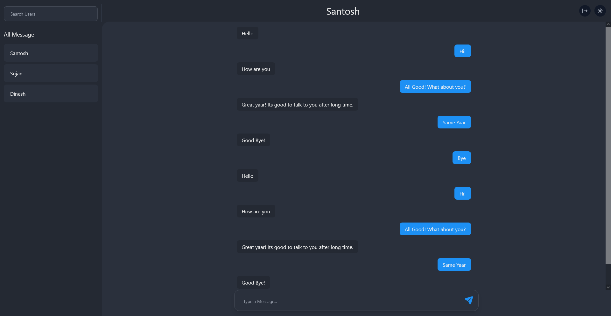
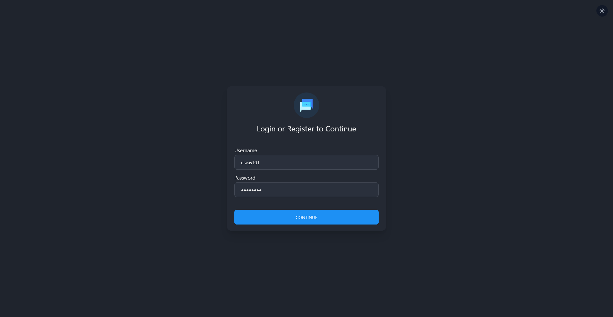

# Svelte and Typescript Chat App

### [Backend Application in Express](https://github.com/diwas10/express-sqlite-chat)

## Work in Progress...

### Libraries Stack

- Typescript
- socket.io-client
- axios
- tailwind
- yup

### Configuration

- Reusable Svelte Components
- Layout Components
- Custom Form handler
- Form Validation with yup
- Socket.io Configuration
- Token Service (Handling Tokens)
- Api Request Service
- Comprehensive Store Setup with loading, success and data state
- jwt parser to get the payload

### Features

- Light and Dark Mode
- One to One Chat
- Group Chat
- Login and Register
- Notification and Sound on Message

#### Chat Screen

#### Login Screen

